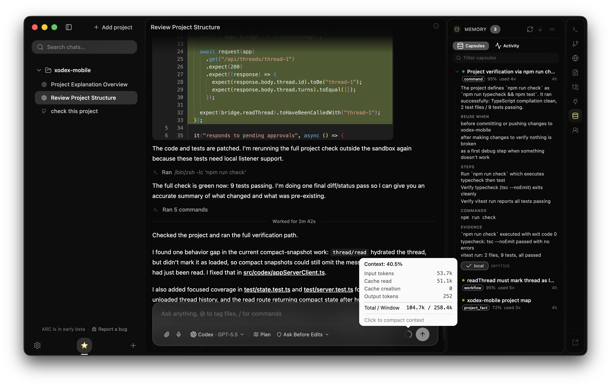

# Agent Run Cache (ARC)

> ARC watches a coding agent solve something in your repo, keeps the route that
> worked, and hands it back the next time you ask for the same kind of thing.

[](https://github.com/arc-cache/desktop/releases/latest)
[](#license)
[](https://github.com/arc-cache/desktop/releases/latest)
[](https://github.com/arc-cache/desktop/releases/latest)



ARC is a local-first desktop app that sits alongside your coding agent. When a run
succeeds, it keeps the verified route (the commands, the files, the check that
proved it worked) and drops a short note into the next similar prompt, so the agent
picks up from the proven path instead of rediscovering it.

This is an early public build. Capsules and run traces stay on your machine unless
you explicitly mark a capsule shareable and upload it to a workspace.

## Why ARC

Agents are good at figuring a repo out. They are bad at remembering they already
did. The same questions come back run after run: which test command actually
passes, where a flow lives, which approach already failed, which files you have to
read before touching a subsystem.

Reaching for a memory feature tends to make this worse. Chat history is noisy and
docs drift, and a general note-keeper will happily inject something that used to be
true into a run where it no longer is.

ARC stays narrow. It saves a capsule: the steps that worked, tied to the goal you
were after, not the words you typed. A missed capsule just means the agent works it
out again. A wrong capsule can derail the next run, so ARC saves almost nothing it
isn't sure about.

## What a capsule looks like

A capsule is the route, not a transcript. Here is one ARC might keep after a green
test run:

```
Capsule: Run the integration test suite
First move: bring up the test db, then run the suite
Reuse when: running or fixing integration tests
Do not reuse when: only unit tests changed
Binding sources to verify: vitest.config.ts, test/integration/**
Command shapes: docker compose up -d test-db
                pnpm test:integration
Validation probe: "Test Files  12 passed (12)", exit code 0
Dead ends to avoid: plain `pnpm test` skips the db, dies on "connection refused"
```

*Trimmed from the note ARC actually injects; the live note also carries
verification-policy lines. Real capsules are captured from your runs, not written by
hand.*

Every field there came out of a run that finished and proved itself. The dead end is
one ARC watched happen and kept, so the agent does not wander back into it.

## How it works

ARC runs in six stages. The capsule forms in stages two through four.

1. It tails your agent's event stream on-device: prompts, tool calls, command exit
   codes, edited paths. Nothing about your agent setup changes.
2. When a turn ends, a deterministic gate triages it. Small talk, no-ops, and runs
   that failed or were aborted get dropped on the spot. Clear wins go forward; the
   in-between cases are handed to your own agent to judge.
3. ARC then confirms the run succeeded, reading tool exit codes and the final
   message for outcome signals. No evidence of success, no capsule.
4. Your agent (Claude Code, Codex, Copilot, whatever you are running) writes the
   capsule from only that evidence. ARC has no model of its own and never invents
   a command it did not see.
5. On a later prompt, a small on-device embedder looks for the closest capsule. If
   nothing is close enough it stays quiet instead of injecting a weak guess. On a
   match, you get the short note.
6. Each capsule remembers the files it leaned on. When those move, it goes stale and
   drops out of the suggestions, because a confidently wrong command is worse than
   none.

## Run telemetry and policy

Copilot runs through either the ACP middleware or ARC Desktop write the same redacted local run record to
`.agent-run-cache/telemetry.jsonl`. It keeps tool kind, paired duration and outcome,
retry counts, session outcome, observed model latency, token usage, cost provenance,
and retrieval outcome. It does not keep prompts, commands, tool output, paths, or
workspace text in telemetry. Native ACP usage and cost are labeled `provider`; when
usage is absent, token counts are labeled `estimate` and cost remains `unknown`.

Run `arc metrics --json` for latency percentiles, failed-tool rate, token/cost totals,
policy warnings, per-session costs, and recorded-trace replay results. The same view is
available in ARC Desktop under **Memory → Metrics**, and under Metrics in `arc panel`.
`arc replay-eval --json` runs just the replay
checks: observed retrieval precision, weak-match abstention, stale-capsule rejection,
telemetry redaction, and whether an injected run had a clean successful outcome. The
help result is deliberately identified as a deterministic observational proxy, not a
causal claim.

Warning and hard reviewer budgets are configured locally in
`.agent-run-cache/telemetry-policy.json`:

```json
{
  "warnings": {
    "costUsdPerSession": 2,
    "slowToolMs": 30000,
    "repeatedFailures": 2,
    "retriesPerSession": 3
  },
  "reviewer": {
    "maxCallsPerSession": 4,
    "hardCostUsdPerSession": 0.5,
    "estimatedCostUsdPerCall": 0.08
  }
}
```

Omit a value to use the default, or set it to `false` to disable that budget. A
reviewer cost hard limit can stop before the next ARC-controlled strong review when
`estimatedCostUsdPerCall` is set; without a per-call estimate it stops once known
reviewer cost reaches the limit. The estimate is always labeled as such. Environment
overrides use `AGENT_RUN_CACHE_WARN_COST_USD`,
`AGENT_RUN_CACHE_WARN_SLOW_TOOL_MS`,
`AGENT_RUN_CACHE_WARN_REPEATED_FAILURES`,
`AGENT_RUN_CACHE_WARN_RETRIES`, `AGENT_RUN_CACHE_REVIEWER_MAX_CALLS`,
`AGENT_RUN_CACHE_REVIEWER_HARD_COST_USD`, and
`AGENT_RUN_CACHE_REVIEWER_ESTIMATED_COST_USD_PER_CALL`.

Debug bundles include only the sanitized aggregate metrics and evaluations, never the
raw telemetry records.

## What ARC will not do

It is not a notes app and not a general memory store. It keeps evidence-backed
routes, nothing more: no running the coding work for you, no summaries of your day,
no free-form text you might want later. And if you switch agents mid-project, the
provider you chose for the session is the one ARC uses to review and title. It does
not quietly fall back to another.

## Team sharing

Capsules can be shared to a workspace after GitHub/email sign-in. Shared capsule
bodies are encrypted on your device with AES-256-GCM before upload, and workspace
keys are wrapped per member device with RSA-OAEP.

## Download

| Platform | Download |
|----------|----------|
| macOS (Apple Silicon) | [Latest release](https://github.com/arc-cache/desktop/releases/latest) |
| Linux (x64) | [Latest release](https://github.com/arc-cache/desktop/releases/latest) |

Use ARC with the local agent you already run. The desktop app ships engines for
Claude Code, Codex, and Copilot, and can add external ACP agents. Install and sign
in to the one you want; the GitHub Copilot CLI is only needed for Copilot workflows.

### Desktop and ARC Copilot together

ARC Desktop bundles its runtime inside the application and does not install or
own a global `arc` executable. ARC Copilot is the sole owner of the `arc` and
`agent-run-cache` command aliases. Both products deliberately use the same local
`.agent-run-cache` project data, so they can be installed together without a PATH
or npm package collision.

Install or upgrade ARC Copilot with its migration-aware installer. It removes the
retired global `agent-run-cache` npm package, upgrades `arc-copilot`, reconciles
the earlier native install location, and verifies the resulting command:

```bash
curl -fsSL https://raw.githubusercontent.com/arc-cache/copilot/main/install.sh | sh
```

Windows PowerShell:

```powershell
irm https://raw.githubusercontent.com/arc-cache/copilot/main/install.ps1 | iex
```

## Quickstart

1. Open ARC and point it at a repo you work in.
2. Run a real task through your agent until it lands: a fix, a build, a test run, a
   deploy.
3. ARC reviews the finished turn. If it sees success evidence, it saves a capsule.
   Saved capsules show under Memory; turns it declined stay under Activity, so you
   always know whether it skipped on purpose or hit a snag.
4. Later, ask for something similar. On a match, ARC drops the saved route into the
   prompt, and the agent starts from there, not from zero.

## Development

```bash
npm install
npm run app:install
npm run app:dev
```

## Scope

This repo holds the local ARC runtime and desktop app. Team sharing in this build
is deliberately narrow: workspace auth, invites, encrypted capsule upload/pull,
and the free workspace limits above.

## License

This repository uses split licensing:

- The ARC runtime at the repository root is licensed under Apache-2.0. See [LICENSE](LICENSE).
- The desktop app under `apps/arc-app` includes MIT-licensed app code. See [apps/arc-app/LICENSE](apps/arc-app/LICENSE).

Release builds include both notices.
